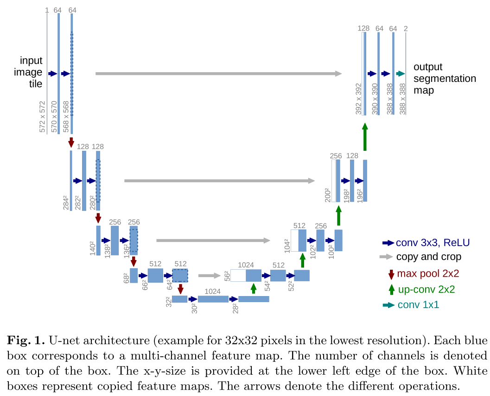
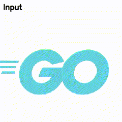

# unet-pytorch
In this repository, I've implemented the U-Net architecture for segmentation. We can explore a simple segmentation task and learn how to implement the U-Net architecture from scratch.

<br></br>

## How to create a local environment

You can create local environment by running following commands.

```bash
conda create -n unet python=3.11
conda activate unet
conda install pytorch torchvision pytorch-cuda=12.1 -c pytorch -c nvidia
pip install -r requirements.txt
```

<br></br>

# U-Net architecture
U-Net architecture is used in many machine learning tasks like segmentation and diffusion models.
U-Net is built on the architecture shown below. The height and width of the image are reduced, and when the number of channels reaches $1024$, the height and width of the image are increased little by little in the opposite direction. This structure is called U-Net architecture because it resembles the shape of **U**.



U-Net consists mainly of the following parts.

- Convolution block
- Max pooling
- Up convolution
- Copy and crop

## Convolution block
The blue arrow of upper image represents the convolution block. It is composed of a convolutional layer followed by a ReLU activation layer. The convolutional layer employs a kernel size of $3\times 3$ with no padding. As a result of processing through this block, the spatial dimensions of the input image(width and height) are reduced by $4$ pixels, transitioning from $572\times 572$ to $568 \times 568$. The example of convolution block with pytorch is as follows.

```python
class ConvBlock(nn.Module):
    def __init__(self, in_channels=1, out_channels=64):
        super(ConvBlock, self).__init__()
        self.conv_block = nn.Sequential(
            nn.Conv2d(in_channels, out_channels, kernel_size=3, padding=0),
            nn.ReLU(inplace=True),
            nn.Conv2d(out_channels, out_channels, kernel_size=3, padding=0),
            nn.ReLU(inplace=True),
        )

    def forward(self, x):
        return self.conv_block(x)
```

## Max pooling
The red arrow in the upper image denotes a $2 \times 2$ max pooling layer, which reduces the spatial dimensions of the image(width and height) by half while increasing the number of channels. We can use `MaxPool2d` function of pytorch to do that.

```python
enc_0 = self.enc_0(x)
enc_1 = self.enc_1(nn.MaxPool2d(2)(enc_0))
```

## Up convolution
The green arrow in the upper image represents an upsampling operation achieved through transposed convolution, also known as deconvolution. We can use `ConvTranspose2d` function of pytorch to implement it.

```python
self.upconv_0 = nn.ConvTranspose2d(128, 64, kernel_size=2, stride=2)
```

## Copy and crop
The gray arrow in the upper image represents copy-and-crop manipulation.
We crop the data from the encoder process and copy it to the decoder process. Due to the convolution block, the size(width, height) of the encoder is smaller than the that of the decoder. Therefore, we need to align the dimention by running the following process.

```python
def align_dim_between_encoder_decoder(enc_dim, dec_dim):
    start = (enc_dim - dec_dim) // 2
    end = start + dec_dim
    return start, end

start, end = align_dim_between_encoder_decoder(enc_3.shape[2], dec_3.shape[2])
enc_3 = enc_3[:, :, start:end, start:end]
```

You can check U-Net architecture by running the following commands.

```bash
cd srcs
python3 unet.py
```

<br></br>

# Loss function
We use [BCEWithLogitsLoss](https://pytorch.org/docs/stable/generated/torch.nn.BCEWithLogitsLoss.html) of pytorch's function which combines a sigmoid layer and the BCELoss(Binary cross entropy) in one single class.

$$
\ell(x, y) = L = \{l_1, \dots, l_N\}^\top, \quad l_n = -w_n \left[ y_n \cdot \log \sigma(x_n) + (1 - y_n) \cdot \log (1 - \sigma(x_n)) \right]
$$

In this dataset, foreground area is much smaller than background area, so we use `pos_weight` parameter to decrease that imbalance. To simplify, we decide pos_weight value manually, but it is better to use more robust method in a more complicated task.

```python
loss_fn = nn.BCEWithLogitsLoss(pos_weight=torch.tensor([10.0]).to(device))
```

<br></br>

# Dataset
We try to segment a Golang logo because its shape is simple, and I like Golang. By augmentation, we can prepare training dataset. 


<br></br>

# How to run
First, we create an annotation data by the following command.

```bash
cd srcs
python3 annotate_logo.py
```

Next, we augment input data to increase the dataset size.

```bash
cd srcs
python3 create_dataset.py
```

We can run training with following commands.

```bash
cd srcs
python3 train.py
```

In this code, we use the following parameters as default.

```
- Optimizer -> Adam
- Loss -> Binary cross entropy
- Learning rate -> 1e-4
- Epoch -> 5
```

We can run segmentation by running following commands.

```bash
cd srcs
python3 predict.py
```

The segmentation result is shown below. As you can see, it works well.



<br></br>

# References
- [U-Net: Convolutional Networks for Biomedical Image Segmentation](https://arxiv.org/pdf/1505.04597)
- [BCEWithLogitsLoss](https://pytorch.org/docs/stable/generated/torch.nn.BCEWithLogitsLoss.html)
